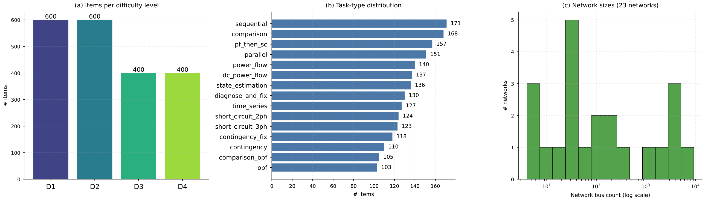

# PowerCodeBench

[](https://arxiv.org/abs/2605.31478)
[](LICENSE)

**PowerCodeBench** is an execution-validated benchmark for LLM-based power-system
code generation. Each task pairs a natural-language operator query with an
executable [`pandapower`](https://www.pandapower.org/) program and a numerical
(or boolean) ground-truth scalar. The benchmark is generated by a parameterised
generator and **frozen at 2,000 tasks** for this release.

It accompanies the paper [*"Knowledge Boundary Probing and Demand-Guided
Intervention for LLM-Based Power System Code Generation"*](https://arxiv.org/abs/2605.31478)
(Wu, Wang, Fan, 2026).

> **Release status.** This repository currently contains the **frozen benchmark
> dataset only**. The full probing / demand-modelling / intervention /
> evaluation pipeline will be released upon publication.

## Contents

| File | Description |
|------|-------------|
| `benchmark.json` | The 2,000 frozen tasks (see schema below). |
| `requirements.txt` | Pinned runtime for executing the reference solutions. |
| `LICENSE` | Creative Commons Attribution 4.0 International (CC BY 4.0). |
| `assets/` | Figures used in this README. |

## Dataset at a glance

The release contains **2,000 tasks**. Every task is independently solvable: its
`reference_code` is a self-contained `pandapower` script that prints a single
scalar `result`, which is recorded as `ground_truth`. Answer types are
**1,848 float**, **108 int**, and **44 bool**.

**Difficulty levels.** Tasks are split across four difficulty tiers, balanced
600 / 600 / 400 / 400:

- **`D1_basic` (600)** — a single analysis with at most a simple modification.
- **`D2_multi_step` (600)** — several network edits before a single analysis.
- **`D3_semantic` (400)** — the operator intent is expressed semantically and
  must be resolved to a concrete element (e.g. *"the most heavily loaded
  transformer"*). These carry an extra `eval_criteria` field (see schema).
- **`D4_compound` (400)** — multi-part workflows (compare / diagnose-and-fix /
  sequential / parallel analyses). These also carry `eval_criteria`.

**Task families (15).** The query targets span both single-analysis and
compound workflows (counts in parentheses):

- *Single analysis* — `power_flow` (140), `dc_power_flow` (137),
  `opf` (103), `short_circuit_3ph` (123), `short_circuit_2ph` (124),
  `state_estimation` (136), `time_series` (127), `contingency` (110).
- *Compound / repair* — `comparison` (168), `comparison_opf` (105),
  `sequential` (171), `parallel` (151), `pf_then_sc` (157),
  `contingency_fix` (118), `diagnose_and_fix` (130).

**Grid networks.** The generator draws from a pool of **39** distinct
`pandapower` test cases spanning roughly **5 to ~9,200 buses**; this
frozen release instantiates **23** of them. The pool covers standard
MATPOWER/PYPOWER cases (`case5`, `case9`, `case14`, `case30`, `case57`,
`case118`, `case300`, the PEGASE series up to `case9241pegase`, the RTE
series), IEEE cases (`case24_ieee_rts`, `case_ieee30`), CIGRE networks
(`cigre_lv` / `cigre_mv` / `cigre_hv`), Kerber low-voltage networks, and
synthetic/regional grids (`GBnetwork`, `oberrhein`, `iceland`, …).

**Composition figure.** The exact per-difficulty, per-task-family, and
per-network distributions are shown below (reproduced from the paper):



*(a) Item count per difficulty level (D1–D4). (b) Task-family frequency across
the 15 families sampled in this release. (c) Grid network size distribution
(bus count) across the 23 networks instantiated in this release.*

## Record schema

`benchmark.json` is a JSON array of 2,000 objects. Each object has:

| Field | Type | Description |
|-------|------|-------------|
| `id` | string | Unique 12-character hex task identifier. |
| `scenario` | object | Structured task spec: `network` (case name), `task` (family), `modifications` (list of network edits), and `query_target` (`qtype`, `table`, `column`, `filter_idx`). |
| `natural_language_query` | string | The operator query in English. |
| `reference_code` | string | Self-contained `pandapower` Python program that computes and `print`s the answer as `result`. |
| `ground_truth` | float \| int \| bool | The expected scalar answer. |
| `ground_truth_type` | string | One of `"float"`, `"int"`, `"bool"`. |
| `difficulty_level` | string | One of `D1_basic`, `D2_multi_step`, `D3_semantic`, `D4_compound`. |
| `eval_criteria` | object *(optional)* | **Present only on the 800 `D3_semantic` and `D4_compound` items.** Holds semantic-grounding metadata (`semantic_source`, `semantic_rule`, `semantic_phrases`) used to score whether the model resolved the intended element. Absent on `D1`/`D2`. |

## Quickstart

```bash
python -m venv .venv && source .venv/bin/activate
pip install -r requirements.txt
```

```python
import json, pandapower  # noqa: F401

tasks = json.load(open("benchmark.json"))
print(len(tasks), "tasks")

t = tasks[0]
print(t["natural_language_query"])
exec(t["reference_code"])      # prints the computed scalar
print("ground truth:", t["ground_truth"], f"({t['ground_truth_type']})")
```

> ⚠️ **Use the pinned environment.** The ground truths were generated with
> `pandapower==3.4.0`, `numpy==2.2.6`, `pandas==2.3.3` (Python 3.11). With
> **pandas ≥ 3.0** even a plain `pandapower` power flow raises
> `ValueError: assignment destination is read-only`, so the reference solutions
> will not run. Always install from `requirements.txt`.

## License

This dataset (including the embedded reference code) is released under the
**Creative Commons Attribution 4.0 International License (CC BY 4.0)** — see
[`LICENSE`](LICENSE). You are free to share and adapt it, including for
commercial use, provided you give appropriate credit (cite the paper below).

## Citation

If you use PowerCodeBench, please cite:

```bibtex
@article{wu2026powercodebench,
  title         = {Knowledge Boundary Probing and Demand-Guided Intervention
                   for LLM-Based Power System Code Generation},
  author        = {Wu, Hui and Wang, Xiaoyang and Fan, Zhong},
  year          = {2026},
  eprint        = {2605.31478},
  archivePrefix = {arXiv},
  primaryClass  = {cs.SE},
  doi           = {10.48550/arXiv.2605.31478}
}
```
