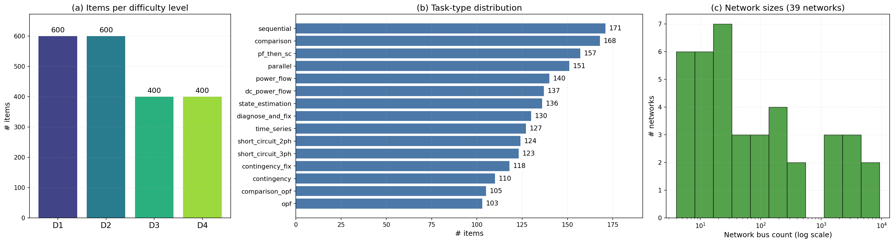

# PowerCodeBench

[](https://doi.org/10.1016/j.aei.2026.105328)
[](https://arxiv.org/abs/2605.31478)
[](LICENSE)
[](code/LICENSE)

**PowerCodeBench** is an execution-validated benchmark for LLM-based
power-system code generation. Each of its 2,000 frozen tasks pairs a
natural-language operator query with a runnable `pandapower` program and a
ground-truth scalar, so a candidate answer is scored by executing it. Use it
to evaluate a model, a prompting strategy, or an agent on power-system
analysis code; [the benchmark section](#the-benchmark) describes the tasks and
[Quickstart](#quickstart) shows how to load them.

## Verifying the reported numbers

This repository is the benchmark's official distribution and also the code
and frozen-data artifact for
[*"Knowledge Boundary Probing and Demand-Guided Intervention for LLM-Based
Power System Code Generation"*](https://doi.org/10.1016/j.aei.2026.105328)
by Hui Wu, Xiaoyang Wang, and Zhong Fan, published in *Advanced Engineering
Informatics*, volume 77, Part 2, article 105328 (January 2027). The article
was first published online on 3 October 2026. Every manuscript table
maps to a public evidence path here, and the headline claims are rebuilt from
the underlying item-, probe-, judgement-, and measurement-level records.

[`ARTIFACT_INDEX.md`](ARTIFACT_INDEX.md) is the master map from reported
claims to frozen evidence files and their generating scripts. It covers
main-text Tables T2–T12, Supplementary Tables S1–S19, and the evidence behind
the published figures and headline numbers. The published Supplementary
Material contains Figures S1–S2; additional repository plots are labelled
separately in the index.

One command recomputes the paper's numerical results (CPU-only, standard
library only, no network). Run it on Python 3.11, the interpreter of the
frozen experimental environment and the version CI pins:

```bash
python3 reproduce.py
```

CPython ≥ 3.12 changed built-in `sum()` to compensated summation, which
shifts five recomputed statistics by one ulp and fails their field-for-field
equality checks against the frozen artifacts.

The verifier prints a PASS/FAIL table for each numbered evidence group. The
groups cover the primary T3–T6 outcome and token tables; paired bootstrap and
TOST comparisons; raw-to-profile L0–L3 evidence, the frozen demand tables and
recoverable item rankings, router shares, and probe–R0 correlations; backend
transfer and C-recal; reasoning, risk, seed, budget, and C-unadapted
robustness analyses; engineering-validity, matcher, and failure-taxonomy
audits; naturalistic and external queries; and serving/energy measurements.
Run `python3 reproduce.py --help` for the live group list, or select one
group, for example:

```bash
python3 reproduce.py --group 15
```

The full run takes several minutes because it retains the frozen
10,000-resample paired bootstrap. Most individual groups finish in seconds.

Here, **reproduce** means recomputing the numerical values underlying the
paper's tables, figures, contrasts, and audit summaries from the frozen public
records. It does not repeat paid API calls or GPU inference and serving
measurements; those runs
are archived, and the released item-, transcript-, event-, judgement-, and
measurement-level records are what the CPU-only verifier reads. A few evidence
families ship in reduced form, with a sampling frame or a labelled
deterministic rerun in place of bulk historical logs;
[`docs/PROVENANCE_BOUNDARIES.md`](docs/PROVENANCE_BOUNDARIES.md) lists which
families and what each one retains, and `ARTIFACT_INDEX.md` marks the affected
rows.

For the shortest verification path, environment/version checks, method-module
smokes, and the boundary between claim verification and fresh GPU/API runs,
see [`RUNBOOK.md`](RUNBOOK.md).

## Repository structure

```
ARTIFACT_INDEX.md          claim → artifact → script map
RUNBOOK.md                 verification, environment, and rerun boundary
reproduce.py               one-command headline-number verification
benchmark.json             the frozen 2,000-task benchmark (this release)
audit/                     engineering-validity, matcher-FN, and parity audit artifacts
external_queries/          E4 external query sets, construction ledgers, frozen evals
transfer/                  E2 backend-transfer defect ledger + import scans
serving/measurement_json/  E3 serving measurements (protocol A/B, per-rep energy/meta)
results/full_matrices/     per-difficulty / per-task / trajectory matrices (SM Tables S7–S9)
results/aggregates/        frozen aggregate JSONs (the CPU-only number-rebuild set)
results/raw/               compact item-level runs for primary, transfer,
                           robustness, ablations, and 29,120 raw probe records
results/supplementary_evidence/
                           probe, recoverable demand-query, and router evidence
results/demand_suites/     frozen task-demand suite exports consumed by conditions C/X
benchmark/                 E2 minibenches, E4 query sets, holdout, composition stats
dataset/                   API-spec corpus, L0-L3 probe set, augmented supervision
code/                      method code (generator, probing, demand, intervention,
                           backend) + analysis/aggregation scripts; see code/README.md
docs/                      instrument migration ledger, verbatim prompt templates
environment/               frozen software environment (conda YAML + full pip freeze)
assets/                    publicly regenerated README and manuscript figures
```

The public code under `code/` contains the analysis/reaggregation code and
reusable method modules for the parameterised benchmark generator, L0–L3
knowledge-boundary probing, task-demand modelling, knowledge injection, and
the serving backend/orchestrator; [`code/README.md`](code/README.md) maps paper
components to files. Released item-, transcript-, event-, judgement-, and
measurement-level records support the CPU-only numerical rebuild and method
inspection. Fresh open-weight or provider-API experiments additionally require
the relevant model access, hardware or service credentials, and the recorded
runtime environment. [`RUNBOOK.md`](RUNBOOK.md) gives both verification paths,
and `environment/` records the frozen software snapshot.

---

## The benchmark

Each task pairs a natural-language operator query with an executable
[`pandapower`](https://www.pandapower.org/) program and a numerical
(or boolean) ground-truth scalar. The benchmark is generated by a
parameterised generator and **frozen at 2,000 tasks** for this release.

## Dataset at a glance

The release contains **2,000 tasks**. Every task is independently solvable: its
`reference_code` is a self-contained `pandapower` script that prints a single
scalar `result`, which is recorded as `ground_truth`. Answer types are
**1,848 float**, **108 int**, and **44 bool**.

**Difficulty levels.** Tasks are split across four difficulty tiers, balanced
600 / 600 / 400 / 400:

- **`D1_basic` (600)** — a single analysis with at most a simple modification.
- **`D2_multi_step` (600)** — several network edits before a single analysis.
- **`D3_semantic` (400)** — the operator intent is expressed semantically and
  must be resolved to a concrete element (e.g. *"the most heavily loaded
  transformer"*). These carry an extra `eval_criteria` field (see schema).
- **`D4_compound` (400)** — multi-part workflows (compare / diagnose-and-fix /
  sequential / parallel analyses). These also carry `eval_criteria`.

**Task families (15).** The query targets span both single-analysis and
compound workflows (counts in parentheses):

- *Single analysis* — `power_flow` (140), `dc_power_flow` (137),
  `opf` (103), `short_circuit_3ph` (123), `short_circuit_2ph` (124),
  `state_estimation` (136), `time_series` (127), `contingency` (110).
- *Compound / repair* — `comparison` (168), `comparison_opf` (105),
  `sequential` (171), `parallel` (151), `pf_then_sc` (157),
  `contingency_fix` (118), `diagnose_and_fix` (130).

**Grid networks.** The generator's registry holds **40** distinct
`pandapower` test cases spanning roughly **5 to ~9,200 buses**; this
frozen release instantiates **39** of them (only
`example_multivoltage` is unused). The pool covers standard
MATPOWER/PYPOWER cases (`case5`, `case9`, `case14`, `case30`, `case57`,
`case118`, `case300`, the PEGASE series up to `case9241pegase`, the RTE
series), IEEE cases (`case24_ieee_rts`, `case_ieee30`), CIGRE networks
(`cigre_lv` / `cigre_mv` / `cigre_hv`), Kerber low-voltage networks, and
synthetic/regional grids (`GBnetwork`, `oberrhein`, `iceland`, …).

**Composition figure.** The exact per-difficulty, per-task-family, and
per-network distributions are shown below; the derived statistics are
frozen in `benchmark/composition_stats.json`, and the figure is
regenerated from the release itself by
`code/build/plot_benchmark_stats.py`, which fails if the two disagree:



*(a) Item count per difficulty level (D1–D4). (b) Task-family frequency across
the 15 families sampled in this release. (c) Grid network size distribution
(bus count) across the 39 networks instantiated in this release.*

## Record schema

`benchmark.json` is a JSON array of 2,000 objects. Each object has:

| Field | Type | Description |
|-------|------|-------------|
| `id` | string | Unique 12-character hex task identifier. |
| `scenario` | object | Structured task spec: `network` (case name), `task` (family), `modifications` (list of network edits), and `query_target` (`qtype`, `table`, `column`, `filter_idx`). |
| `natural_language_query` | string | The operator query in English. |
| `reference_code` | string | Self-contained `pandapower` Python program that computes and `print`s the answer as `result`. |
| `ground_truth` | float \| int \| bool | The expected scalar answer. |
| `ground_truth_type` | string | One of `"float"`, `"int"`, `"bool"`. |
| `difficulty_level` | string | One of `D1_basic`, `D2_multi_step`, `D3_semantic`, `D4_compound`. |
| `eval_criteria` | object *(optional)* | **Present only on the 800 `D3_semantic` and `D4_compound` items.** Holds semantic-grounding metadata (`semantic_source`, `semantic_rule`, `semantic_phrases`) used to score whether the model resolved the intended element. Absent on `D1`/`D2`. |

**Text normalization note.** In the public `benchmark.json`, 105 of the
2,000 `natural_language_query` strings have U+2019 (right single
quotation mark) normalized to the ASCII apostrophe. The frozen pipeline
inputs (e.g. `benchmark/c3_splits/`) retain the original character, and
all reported numbers were computed on those frozen versions. CI asserts
that this is the only difference and that it covers exactly those 105
items (`.github/scripts/check_text_normalization.py`).

## Quickstart

> **Trusted input only.** The example below uses unrestricted Python `exec()`.
> Run `reference_code` only from a trusted PowerCodeBench release; do not use this pattern for untrusted or model-generated code.

```bash
python -m venv .venv && source .venv/bin/activate
pip install -r requirements.txt
```

```python
import json, pandapower  # noqa: F401

tasks = json.load(open("benchmark.json"))
print(len(tasks), "tasks")

t = tasks[0]
print(t["natural_language_query"])
exec(t["reference_code"])      # prints the computed scalar
print("ground truth:", t["ground_truth"], f"({t['ground_truth_type']})")
```

> ⚠️ **Use the pinned environment.** The ground truths were generated with
> `pandapower==3.4.0`, `numpy==2.2.6`, `pandas==2.3.3` (Python 3.11). With
> **pandas ≥ 3.0** even a plain `pandapower` power flow raises
> `ValueError: assignment destination is read-only`, so the reference solutions
> will not run. Always install from `requirements.txt`.
> (`reproduce.py` needs none of this — it is standard-library only.)

## Related distributions in this repository

- `benchmark/e2_opendss/` and `benchmark/e2_pypsa/` — the 90-item
  OpenDSS / PyPSA backend-transfer minibenches (E2).
- `benchmark/e4_layer2a/`, `benchmark/e4_layer2b/` — the externally
  sourced and engineer-written query sets (E4), with their full
  collection and screening ledgers.
- `benchmark/naturalistic_holdout/` — the 80-item human-authored
  naturalistic-query holdout with its answer key.
- `benchmark/c3_splits/` — the D1D2 / D3D4 difficulty splits used for the
  demand-model generalization check.

## Licences

This repository is dual-licensed by content type:

- **Data, documentation, and annotations — CC BY 4.0**
  ([`LICENSE`](LICENSE)): `benchmark.json` (including the embedded
  reference code of the tasks), the frozen data/measurement artifacts
  (`audit/`, `benchmark/`, `dataset/`, `external_queries/`, `results/`,
  `serving/`, `transfer/`, `environment/`), the documentation, and the
  figures. You are free to share and adapt them, including for commercial
  use, provided you give appropriate credit (cite the paper below).
- **Code — Apache License 2.0** ([`code/LICENSE`](code/LICENSE)):
  everything under `code/` plus `reproduce.py`.

Third-party texts retain their original licences and are **not**
relicensed by this repository: the sources referenced during
external-query construction (GitHub issue/discussion threads, Stack
Exchange posts, openmod forum threads), and the upstream pandapower
docstrings reproduced in `dataset/pandapower_docs.json` (BSD 3-Clause,
© University of Kassel and Fraunhofer IEE Kassel and contributors). See
[`THIRD_PARTY_NOTICES.md`](THIRD_PARTY_NOTICES.md) and the in-repository
[`pandapower BSD 3-Clause licence text`](licenses/pandapower-BSD-3-Clause.txt).

## Acknowledgements

This paper is partially supported by the SAINTES project funded by the ARIA
Safeguarded AI programme, as well as the Innovate UK funded TRIAGE project.

The authors acknowledge the use of resources provided by the Isambard-AI
National AI Research Resource (AIRR). Isambard-AI is operated by the University
of Bristol and is funded by the UK Government’s Department for Science,
Innovation and Technology (DSIT) via UK Research and Innovation; and the
Science and Technology Facilities Council [ST/AIRR/I-A-I/1023].

## Citation

If you use PowerCodeBench, please cite:

```bibtex
@article{wu2027powercodebench,
  title   = {Knowledge boundary probing and demand-guided intervention
             for {LLM}-based power system code generation},
  author  = {Wu, Hui and Wang, Xiaoyang and Fan, Zhong},
  journal = {Advanced Engineering Informatics},
  volume  = {77},
  pages   = {105328},
  year    = {2027},
  doi     = {10.1016/j.aei.2026.105328},
  url     = {https://doi.org/10.1016/j.aei.2026.105328}
}
```
